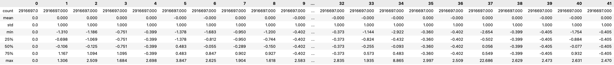
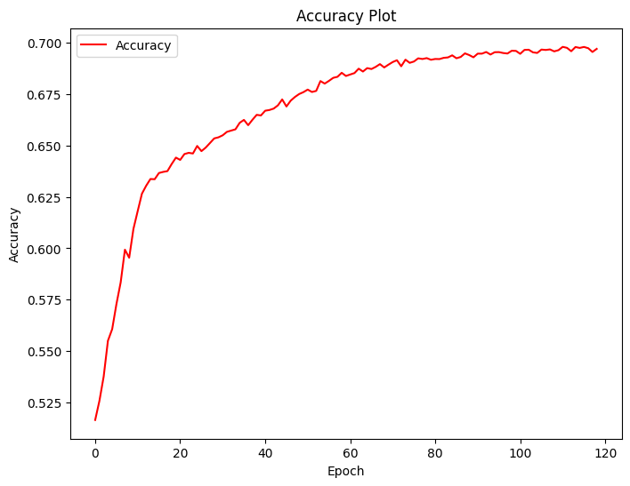
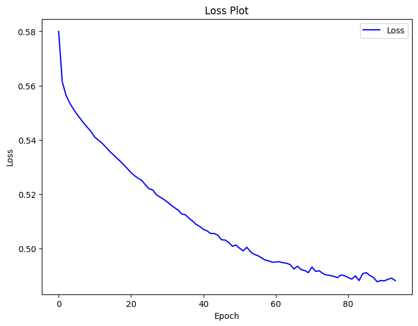

# Introduction
Ransomware is a significant threat in the domain of cybersecurity. It can cause widespread financial loss for individuals and businesses caught up by it. It is a type of malicious software that holds the victim’s data as hostage until the ransom demands are met. Bitcoin is often used as a preferred payment method due to its anonymous nature. During the lecture, we were encouraged to tackle a real-life issue so we decided to go with the Bitcoin Heist Ransomware Address dataset because of its implications with cybersecurity. We were able to analyze the patterns and behaviors in ransomware attacks specifically tied to Bitcoin transactions by examination of underlying relationships present in the ransomware data. Creating a good predictive model to improve the detection of Bitcoin related ransomware can provide valuable insights that greatly impact the continued validity of financial markets around the world.

# Methods

### Data
[](https://archive.ics.uci.edu/dataset/526/bitcoinheistransomwareaddressdataset)

### Notebook
[](https://colab.research.google.com/github/Julie0827/CSE151A-Project/blob/Milestone4/bitcoin_heists_ransomware.ipynb) <br>
[](https://colab.research.google.com/github/Julie0827/CSE151A-Project/blob/Milestone4/bitcoin_heists_KNN.ipynb) <br>
[](https://colab.research.google.com/github/Julie0827/CSE151A-Project/blob/Milestone4/NeuralNetwork.ipynb) <br>
[](https://colab.research.google.com/github/Julie0827/CSE151A-Project/blob/Milestone4/XGBOOST.ipynb) <br>
## Data Exploration

### 1. Overview of the Dataset

- Instance Count: 2,916,697
- Feature Count: 10
- Non-Ransomware Transaction Count: 2,875,284
- Ransomware Transaction Count: 41,413
- Missing Data: None

### 2. Feature Descriptions

- `address`: String. Bitcoin address.
- `year`: Integer. Year of the transaction.
- `day`: Integer. Day of the year. 1 is the first day, 365 is the last day.
- `length`: Integer. Quantifies mixing rounds on Bitcoin.
- `weight`: Float. Quantifies the merge behavior (Represents information on the amount of transactions).
- `count`: Integer. Quantify the merging pattern (Represents information on the number of transactions).
- `looped`: Integer. Counts how many transactions split their coins, move these coins in the network by using different paths, and merge them in a single address.
- `neighbors`: Integer. Number of neighboring transactions.
- `income`: Integer. Satoshi amount (1 bitcoin = 100 million satoshis).
- `label`: Category String. Name of the ransomware family or white (not known to be ransomware).

### 3. Descriptive Statistics


### 4. Pairplot
The pairplot below is generated on a sampled dataset with a sample size of 30,000, which is approximately 1/100 of the original dataset.<br><br>
<br>
We can observe that the data is highly imbalanced, with the number of non-ransomware transactions significantly outnumbering the number of ransomware transactions.

### 5. Correlation
<br>
We can observe that most of the features are barely correlated with each other. However, the correlation coefficient between `length` and `count` is 0.7, which is relatively high compared to the other coefficients.

### 6. Output Class
Our output class is `label`, which contains various ransomware families and non-ransomware (white). After encoding, the output class will contain only 0 (non-ransomware) and 1 (ransomware), and it will then follow a binomial distribution.<br><br>

## Data Preprocessing

### 1. Planned Data Preprocessing Tasks

1. Drop `address`, `year`, and `day` columns
   - `address`: Bitcoin addresses are random, so it doesn't make sense to test on this.
   - `year` and `day`: Hacks may occur more often at certain times of the year or month, but that doesn't help our model and doesn't predict future.
  
2. Encode `label` column
   - We will not differentiate between different ransomware families because there are so many ransomware families, and not all of them have sufficient data points.
   - We will convert all non-white labels to 1 (ransomware) and all white labels to 0 (non-ransomware).

3. Handle data imbalance
   - The number of non-ransomware transactions (2,875,284) significantly outnumbers the number of ransomware transactions (41,413).
   - We will handle data imbalance by applying various methods such as oversampling and undersampling.

4. Address uncertainty in labels
   - While all Bitcoin addresses labeled as `ransomware` are confirmed to be ransomware, we cannot be certain that all addresses labeled as `white` are indeed non-ransomware. This uncertainty may lead to inconsistencies in our models and their classification accuracy.
   - To address this, we will aim to minimize outliers in our training data to reduce any potential impact caused by undetected ransomware addresses.
  
5. Scale features if needed
   - If necessary, we will apply scaling techniques such as normalization or standardization.

### 2. Actual Data Preprocessing

1. Dropping the `address`, `year`, and `day` columns
   - First 5 rows before dropping the columns:<br>
      
   - First 5 rows after dropping the columns:<br>
     

2. Encoding the `label` column
   - Before encoding, the `label` column contained the following unique values:
   ```
   ['princetonCerber' 'princetonLocky' 'montrealCryptoLocker'
    'montrealCryptXXX' 'paduaCryptoWall' 'montrealWannaCry'
    'montrealDMALockerv3' 'montrealCryptoTorLocker2015' 'montrealSamSam'
    'montrealFlyper' 'montrealNoobCrypt' 'montrealDMALocker' 'montrealGlobe'
    'montrealEDA2' 'paduaKeRanger' 'montrealVenusLocker' 'montrealXTPLocker'
    'paduaJigsaw' 'montrealGlobev3' 'montrealJigSaw' 'montrealXLockerv5.0'
    'montrealXLocker' 'montrealRazy' 'montrealCryptConsole'
    'montrealGlobeImposter' 'montrealSam' 'montrealComradeCircle'
    'montrealAPT' 'white']
   ```
   - After encoding, the `label` colum contains the following unique values:
   ```
   [1 0]
   ```
   
3. New pairplot with a sample size of 300,000<br>
   

4. Scaling with power transform and expanding features with polynomial features
   ```py
   deg_3 = PolynomialFeatures(degree=(1,3),interaction_only=True)
   X = deg_3.fit_transform(X)
   scaler = PowerTransformer()
   X_d3_power = scaler.fit_transform(X)
   X_d3_power = pd.DataFrame(X_d3_power)
   ```
   - AFTER scaling and expanding:
     
     
5. Splitting the data into training and test sets
   ```py
   X_train_d3, X_test_d3, y_train_d3, y_test_d3 = train_test_split(X_d3_power, y, test_size=0.2, random_state=0)
   ```
      
6. Storing the Degree 3 test data to CVS
   ```py
   X_test_d3.to_csv('data/BitcoinX_test_d3.csv', index=False)
   y_test_d3.to_csv('data/BitcoinY_test_d3.csv', index=False)
   ```

7. Undersampling Degree 3 training data with a ratio of 1:1
   ```py
   random_under_sampler = RandomUnderSampler(sampling_strategy=1, random_state=10)
   X_train_undersampled_d3, y_train_undersampled_d3 = random_under_sampler.fit_resample(X_train_d3, y_train_d3)
   ```
   - Before undersampling:
      - Count of majority class data points in training set: 2,300,150
      - Count of minority class data points in training set:  33,207
   - After undersampling:
      - Count of majority class data points in training set: 33,207
      - Count of minority class data points in training set: 33,207

8. Storing the undersampled Degree 3 training data to CVS
   ```py
   X_train_undersampled_d3.to_csv('data/BitcoinX_ut_d3.csv', index=False)
   y_train_undersampled_d3.to_csv('data/BitcoinY_ut_d3.csv', index=False)
   ```
    
9. Undersampling to 4:1 ratio then oversampling Degree 3 training data
   ```py
   random_under_sampler = RandomUnderSampler(sampling_strategy=.25, random_state=10)
   X_train_OvUn_d3, y_train_OvUn_d3 = random_under_sampler.fit_resample(X_train_d3, y_train_d3)

   randomOver = RandomOverSampler(sampling_strategy=1, random_state=10)
   X_train_OvUn_d3, y_train_OvUn_d3 = randomOver.fit_resample(X_train_OvUn_d3, y_train_OvUn_d3)
   ```
   - BEFORE undersampling:
      - Count of majority class data points in training set: 2,300,150
      - Count of minority class data points in training set: 33,207
   - AFTER undersampling:
      - Count of majority class data points in training set: 132,828
      - Count of minority class data points in training set: 33,207
   - AFTER oversampling:
      - Count of majority class data points in training set: 132,828
      - Count of minority class data points in training set: 132,828

10. Storing the undersampled AND oversampled Degree 3 training data to CVS
    ```py
    X_train_OvUn_d3.to_csv('data/BitcoinX_ou_d3.csv', index=False)
    y_train_OvUn_d3.to_csv('data/BitcoinY_ou_d3.csv', index=False)
    ```

## Model 1 - K-Nearest Neighbors
[](https://colab.research.google.com/github/Julie0827/CSE151A-Project/blob/Milestone4/bitcoin_heists_KNN.ipynb) <br>

KNN is used here to see if there is any clustering of our data based on class. We tried using different parameters for K, but as K increases accuracy decreases so we use the parameter k = 1 for best accuracy. <br>
### Hyperparameter Test 1
```py 

n_neighbors = 1

KNN = KNeighborsClassifier(n_neighbors = n_neighbors) 

KNN.fit(X_train_undersampled, y_train_undersampled)
```

### Hyperparameter Test 2
```py
n_neighbors = 2

KNN = KNeighborsClassifier(n_neighbors = n_neighbors) 

KNN.fit(X_train_undersampled, y_train_undersampled)
```
## Model 2 - Neural Network
[](https://colab.research.google.com/github/Julie0827/CSE151A-Project/blob/Milestone4/NeuralNetwork.ipynb) <br>

For this model, we tried using different neural networks to try to uncover any underlying patterns in our data and classify based on that. We one-hot encoded the data and ran a variety of different neural networks on the data. We ended up using a higher number of nodes as well as a combination of `ReLU`, `tanh`, and `sigmoid` activation functions for our best model. <br>

### Hyperparameter Test 1
```py
model1 = Sequential()
model1.add(Dense(120, activation = 'sigmoid', input_dim = X_train_undersampled.shape[1])),
model1.add(Dense(units = 80, activation = 'sigmoid'))
model1.add(Dense(units = 40, activation = 'tanh'))
model1.add(Dense(units = 2, activation = 'sigmoid'))
model1.compile(optimizer = SGD(learning_rate = 0.49), loss = 'categorical_crossentropy',metrics=['accuracy'])
```




### Hyperparameter Test 2
```py
model2 = Sequential()
model2.add(Dense(12, activation = 'sigmoid', input_dim = X_train_undersampled.shape[1])),
model2.add(Dense(units = 8, activation = 'sigmoid'))
model2.add(Dense(units = 4, activation = 'sigmoid'))
model2.add(Dense(units = 2, activation = 'sigmoid'))
model2.compile(optimizer = SGD(learning_rate = 0.49), loss = 'categorical_crossentropy',metrics=['accuracy'])
```


### Hyperparameter Test 3
```py
model3 = Sequential()
model3.add(Dense(1024, activation = 'tanh', input_dim = X_train_undersampled.shape[1])),
model3.add(Dense(units = 512, activation = 'relu'))
model3.add(Dense(units = 324, activation = 'tanh'))
model3.add(Dense(units = 216, activation = 'relu'))
model3.add(Dense(units = 128, activation = 'tanh'))
model3.add(Dense(units = 64, activation = 'relu'))
model3.add(Dense(units = 32, activation = 'tanh'))
model3.add(Dense(units = 16, activation = 'relu'))
model3.add(Dense(units = 8, activation = 'tanh'))
model3.add(Dense(units = 4, activation = 'relu'))
model3.add(Dense(units = 2, activation = 'sigmoid'))
model3.compile(optimizer = SGD(learning_rate = 0.49), loss = 'categorical_crossentropy',metrics=['accuracy'])
```




### Best Model Hyperparameters Found:<br>
Based on our observations of the loss and accuracy pair plots for the three models, we concluded that the last model decreased the loss and increased the accuracy most effectively. Therefore, we chose the parameters used in this model as our ideal parameters. <br>


  
## Model 3 - Decision Tree
[](https://colab.research.google.com/github/Julie0827/CSE151A-Project/blob/Milestone4/XGBOOST.ipynb) <br>

Our data is tabular and binary, so XGBoost was a good choice to use to classify our data. First we used basic XGBOOST, then we turned it into a random forest to prevent overfitting. We then changed parameters and tried to get higher accuracy. Finally we did hyper-parameter tuning using GridSearchCV to find optimal hyperparameters to increase accuracy and reduce overfitting. <br>

### Initial XGBoost Decision Tree
``` py
BOOST = XGBClassifier(gamma = 1,max_depth=30, learning_rate=0.5, objective='binary:logistic',n_jobs = 19)
```
### Turning into Decision Forest
```py 

Dtree = XGBClassifier(gamma = 4, num_parallel_tree = 300,max_depth=10, learning_rate=0.25, objective='binary:logistic',subsample = 0.8, colsample_bynode = 0.8, tree_method='hist',n_estimators = 300)

Dtree.fit(X_train_undersampled, y_train_undersampled)
```

### Hyperparameter Test 1
```py
Xboost1 = XGBClassifier(gamma = 5, num_parallel_tree = 100,max_depth=10, learning_rate=0.1, objective='binary:logistic',subsample = 0.8, colsample_bynode = 0.8, tree_method='hist',n_estimators = 300)

Xboost1.fit(X_train_undersampled, y_train_undersampled)
```
### Hyperparameter Test 2
```py 
Xboost2 = XGBClassifier(gamma = 5, num_parallel_tree = 100,max_depth=10, learning_rate=0.1, objective='binary:logistic',subsample = 0.8, colsample_bynode = 0.8, tree_method='hist',n_estimators = 1)

Xboost2.fit(X_train_undersampled, y_train_undersampled)
```
### Using GridSearch with Cross Validation 
```py
param_grid = {
    'max_depth': [10,15],
    'gamma': [2,5],
    'num_parallel_tree': [100,300,50],

}

GridSearchModel = XGBClassifier(objective='binary:logistic',colsample_bynode = 0.75,tree_method = 'hist',n_estimators = 100, learning_rate = 1,subsample = 0.8)


grid_search = GridSearchCV(GridSearchModel, param_grid, cv=3, scoring='accuracy', n_jobs=-1)


grid_search.fit(X_train_undersampled, y_train_undersampled)


print("Best set of hyperparameters: ", grid_search.best_params_)

Xboost3 = XGBClassifier(gamma = 2, num_parallel_tree = 50,max_depth=10, learning_rate=1, objective='binary:logistic',subsample = 0.8, colsample_bynode = 0.8, tree_method='hist',n_estimators = 300)

Xboost3.fit(X_train_undersampled, y_train_undersampled)
```
# Result
## Model 1 - K-Nearest Neighbors Results / Figures
 

The KNN Model was the first model that we tried. We only worked on this model during the first few milestones but soon left it after we saw its limited potential for our data. The recall for this model only reached 0.78 for white labels and 0.42 for ransomware as can be seen above. As you can see, this was not good at all. This model and the decision to move on from it is explained more thoroughly in the discussion section, but to put it simply, we knew that we had to try out different models if we wanted to get better metrics.

## Model 2 - Neural Network Results / Figures


As we can see from the diagrams above, the recall for both classes, white labels, and ransomware, is quite good for the Neural Network model scoring 0.75 for white labels and 0.65 for ransomware during testing. For reference, during training, the model had a recall of 0.76 for ransomware and 0.72 for white labels. Although these scores were not extremely high, it still classifies correctly on a large portion of the data. Even though the precision is poor being at 0.04 for ransomware and 0.99 for white labels during testing, this is fine as the recall is most important for what we are classifying. We care more about our ability to prevent false negatives than preventing false positives as is explained in the conclusion section. <br>

Taking a look at our confusion matrix for this model, our ability to correctly predict that ransomware is present is pretty effective as out of 132,828 ransomware observations, we were able to predict 95,825 of them for training. During testing out of 8206 ransomware observations we predicted 5,352 of them. This model was a huge improvement compared to our previous model, the KNN, increasing the recall on ransomware from 0.42 to 0.65, ultimately being a 0.23 boost! <br>

On the fitting graph, this model was only slightly overfitted. We can see that the recall for testing was only a bit better than the training with the testing being 0.75 and 0.65 while the training was 0.76 and 0.72. It is explained later but simply put, as the training gets better than the testing more and more, the model becomes more and more overfit. However, seeing as the training was only a bit better than the testing, this model was only slightly overfitted.

## Model 3 - Decision Tree Results / Figures


With the metrics displayed above as well as the confusion matrix, we can see that the XGboost model is even better than the Neural Network model. With this model, during testing our recall was able to reach 0.75 for white label. As for the ransomware, the recall was 0.74 which is 0.09 higher than the Neural Network! For training, our model scored 0.84 in recall for white labels and 0.82 for ransomware. Additionally, by analyzing the confusion matrices we can get a more in depth look at how our XGboost performed. Now, for testing, out of the 8206 ransomware observations, we were able to identify 6076 of them. This is much greater than the 5,352 that were found with the Neural Network. We can also see that in our training that the model did very well, identifying 27,206 ransomware out of the total of 33207. This model was greatly improved due to our hyperparameter tuning which is explored in more detail in the methods section. <br>

In essence, the XGboost was our best-performing model, greatly outperforming the previous two models described. There was only one flaw with this model, that being how overfit it was. It can be pretty easy to see that the training greatly outperforms the testing, which based on the fitting graph, is a sign of overfitting. As the training scores become more and more high compared to the testing, the fitting becomes more and more overfit. Our recall for training was 0.84 and 0.82 which is much higher than the 0.75 and 0.74 in the testing. So, this model was overfit. Despite that, it was still our best model in terms of recall for testing. For details about the creation of our models, look to our methods section.

# Discussion
Our process of building a predictive model for our dataset was both long and tedious. We sought to accurately classify and differentiate ransomware bitcoin transactions from legitimate ones. To do this, we would need to clean and preprocess data so that any given model could perform optimally. As with any development process, there were many issues we faced along the way, and the main issue that arose was the severe class imbalance in our data. Naturally, there are a lot more legitimate transactions than fraudulent ones. However, this resulted in a scenario where our dataset had a greater than 100 to 1 ratio of white labels (non-ransomware) to ransomware labels. We have all heard of the idea of garbage data being in and garbage data being out. In this case, our data imbalance meant we were feeding our models bad data, and as a result, we were obtaining bad results. <br>

This was especially evident in our first K-Nearest Neighbors (KNN) model. We were receiving bad scores in the range of 50 or less when it came to predicting if a data point was ransomware. In our case, it is important to keep in mind that predicting a white label to be a ransomware label is a better scenario than predicting a ransomware label to be a white label. If a ransomware transaction is allowed, then there are major ramifications. Thus, this 50% or less score was largely troubling to our group. However, regardless of hyperparameter tuning, we could not achieve good performance with this model, as no matter what changes were made, there were always more white-label neighbors, causing incorrect classifications. Thus, we chose to resort to a different model. <br>

Our next potential model of choice was a Complement Naive Bayes model. This model is a modification of the original Naive Bayes model, designed specifically to work with imbalanced data like ours. However, both renditions of the Naive Bayes model only work optimally when there are clear, linearly independent decision boundaries. The data in our model is real-world data and, as a result, has highly complex relationships. Thus, we choose not to try using this model. <br>

The failure of the Complement Naive Bayes model led us to look for solutions other than changing our model to deal with the imbalance in the data. At this point, we decided to try to downsample and upsample the data so that we could have a more reasonable ratio of white labels to ransomware labels. This would set the stage for our later models, bearing much better results. <br>

With our training data manipulated, we were finally able to consider models that could more effectively capture the complex relationships, like Neural Networks. For our Neural Networks, we experimented with a wide range of combinations for nodes, activation functions, and layers. We tried models with many layers and models with fewer layers. We tuned hyperparameters following model development to get optimal performance. Still, generally, we found it best to stick with a sigmoid output layer for classification and utilize ReLU as our primary activation function in the hidden layers. This allowed us to have an optimized model both in the sense of performance and prediction capability. <br>

Finally, we decided to also implement a decision tree. We found that a single tree greatly overfit the training data, causing our model to get low prediction scores. Since random forests are less prone to overfitting, we tuned the parameters inside the XGboost model in order to run parallel trees and create a random forest. This lead to our models being less overfit and accuracy increasing. <br>

Ultimately, we settled upon using the XGboost rendition of the random forest and neural network. We achieved around 70 - 80% accuracy despite the imbalance in our data. We are still working to fine-tune and get small improvements where we can. <br>

While we do believe we have had great success in our model, we know that there are many caveats to be had here. For example, our data set assumes all white label data points are correctly labeled as white labels when, in reality, many of those white labels could be ransomware that was mistakenly classified as white label. Thus our model could be trained on incorrect data. As a result, when utilized in the real world, it could let past many unrecognized threats. Furthermore, real-world data tends to contain even more noise than what was present in our dataset. We don’t know how our model would perform against data of this sort. Therefore, while our model does excellently for our dataset, we are not sure if it would accomplish its task to the fullest extent in a real-world production environment. These uncertainties make our results seem less believable, as the scores we received might not be replicable with real data. Regardless, models take tuning over time to deal with new situations and we hope to resolve those issues as they are presented. 

# Conclusion
Our ransomware detection project using the Bitcoin Heist Ransomware Address dataset donated to UC Irvine’s Machine Learning Repository has been both challenging and rewarding. We've learned a lot about handling real data and building good predictive models. However, looking back, there are definitely a few things we could have done differently. <br>

First off, even though our models performed pretty well, we could have improved them by doing more hyperparameter tuning. More hyperparameter tuning is usually a good place to start when it comes to improving model performance, so we could have done a larger GridSearch etc., but it would’ve required more resources than we had access to at the time. In addition, for many of us, this was our first interaction with the cryptocurrency industry, and as such we lacked important domain knowledge needed to contextualize our results. In retrospect, choosing a data set that we understood more might have been a smarter move. Testing our models on more diverse datasets could have also helped. Additionally, ensemble methods are strong deterrents for overfitting. In a classification case such as ours with data disparities, utilizing more ensemble learning methods could have improved our accuracy. <br>

In the end, we made significant progress, more than we thought we ever could at the beginning. We created an end-to-end project, and in doing so, we gained a lot more domain knowledge in the field of cryptocurrency, and learned more than we could have ever imagined about machine learning and artificial intelligence. While we believe our project was a success, exploring additional ensemble methods could have taken our ransomware detection models to the next level. <br>

# Statement of Collaboration
**Jason Huynh** - I helped organize group meetings, experimented with running different models, provided regular feedback, and drafted the README conclusion. <br>

**Joshua Caneday** - I contributed to the README results section, analyzed the metrics of the models, and tested out a couple models such as a decision tree. <br>

**Julie Hong** - I worked on the setup, data exploration, and preprocessing parts, and also experimented with various models such as neural networks. I contributed to the README file and continued organizing and cleaning the code. <br>

**Jonathan Yi** - Explored and preprocessed data, experimented with a neural network model using ReLU/Sigmoid, and drafted the README introduction. <br>

**Raymond Williams** - Experimented with the development of neural networks, developed  documentation and discussion of our developmental process in the readme file. <br>

**Zachary Elders** - I wrote the code for models and data processing and did some work on the readme file for all milestones. <br>

Our team didn’t have a specific leadership role. Rather, we worked collaboratively with mutual accountability. We constantly communicated and shared our ideas and feedback through regular in-person meetings, online meetings, and Discord chat. All members contributed to our project in one way or another.

